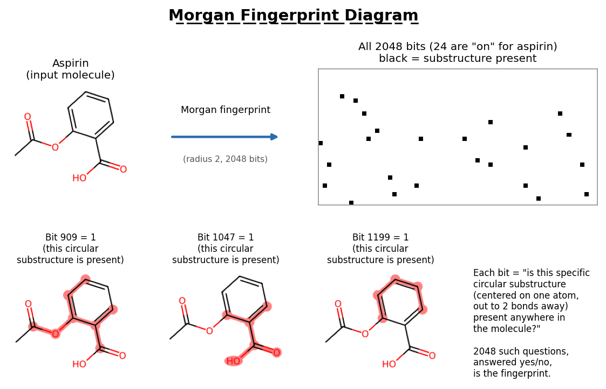
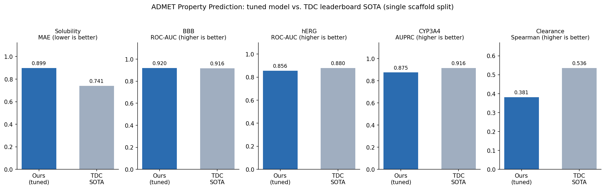

# ADMET Property Prediction

## Overview
The goal of this project was to build machine learning models that predict a molecule's ADMET properties (absorption, distribution, metabolism, excretion, and toxicity) directly from its chemical structure. This is one of the most common early-stage screening tasks computational drug discovery teams use to decide which candidate compounds are worth advancing.

## Motivation
I'm currently pursuing a master's at UCSF in AI Computational Drug Design and Development (AICD3), and applied computational drug discovery roles like this are exactly the kind of industry position I'm aiming for. ADMET properties are one of the fundamentals taught early in this field, critical to actually designing viable drugs, and a class covering them recently is what inspired me to turn the topic into a full project of my own.

My coursework so far hasn't given me this kind of build-it-yourself, end-to-end experience, and I'm not yet part of an on-campus lab project, so this was my way of getting real hands-on practice: learning how to actually build and evaluate a model, work with public datasets, and use tools like VS Code and Claude Code, applied specifically to the drug discovery space rather than as a generic ML exercise.

## Datasets
All the data came from Therapeutics Data Commons' (TDC) "ADMET Benchmark Group," which contains 22 standardized property-prediction tasks with train/test splits already defined. I selected 5 properties covered in my coursework at UCSF: Solubility, BBB permeability, hERG blockade, CYP3A4 inhibition, and Clearance.

## Approach
Each molecule's SMILES string was converted into two complementary numeric representations: a 2048-bit Morgan fingerprint (encoding which substructures are present) and a set of Lipinski-style descriptors (molecular weight, LogP, hydrogen bond donors/acceptors, rotatable bonds).



Models were trained on TDC's scaffold split rather than a random split: molecules are grouped by their core structure (scaffold), so structurally similar compounds can't leak between train and test. This tests generalization to genuinely novel chemistry, the way real drug discovery does. A baseline random forest was trained per property, evaluated on each dataset's own correct TDC leaderboard metric (ROC-AUC for BBB/hERG, AUPRC for CYP3A4, MAE for Solubility, Spearman correlation for Clearance).

From there, three improvements were layered in: a sixth descriptor (TPSA, topological polar surface area), added after EDA showed it was one of the strongest individual signals in the data; XGBoost (gradient boosting) tested against the random forest baseline; and hyperparameter tuning, searching over parameters like number of trees and tree depth via scaffold-grouped cross-validation, so tuning itself couldn't overfit by letting structurally similar molecules leak across CV folds, the same way the train/test split prevents it.

Finally, two analyses went beyond just reporting a metric. Permutation importance identified which *features* (not properties: individual inputs like MolLogP or a fingerprint bit, as opposed to the ADMET endpoint being predicted) the model actually relied on, rather than trusting the model's default importance ranking, which turned out to be biased toward certain feature types. This made it possible to check whether the model's behavior actually lined up with known medicinal chemistry, not just its accuracy number. A failure mode analysis then looked at where each model was most wrong and tried to explain why.

## Repository Structure
```
├── Data_EDA.ipynb                 # Week 1: dataset loading, cleaning, exploratory analysis
├── Featurization_Baseline.ipynb   # Week 2: fingerprints/descriptors, baseline RF per property (sealed/frozen)
├── Model_Improvement.ipynb        # Week 3: TPSA, XGBoost, hyperparameter tuning, feature importance, failure modes
├── RDKit-test.ipynb               # Week 0: environment sanity check
├── NOTES.md                       # detailed write-ups, reasoning, and technical concept explanations
├── CLAUDE.md                      # running project log / status
├── environment.yml                # reproducible conda environment
├── results/
│   └── results_summary.png        # final results vs. TDC leaderboard, all 5 properties
└── data/                          # downloaded automatically by PyTDC, not tracked in git
```

## Setup
```bash
conda env create -f environment.yml
conda activate admet
```
No manual data download needed: PyTDC fetches each dataset automatically the first time a notebook calls `.get_split()`, and caches it locally under `data/`.

## Results
Final result per property (best model after XGBoost + hyperparameter tuning), each evaluated on its own correct TDC leaderboard metric, compared against the TDC leaderboard's published state-of-the-art on that same metric:

| Property | Task | Metric | Result | TDC SOTA |
|---|---|---|---|---|
| Solubility | Regression | MAE (lower is better) | 0.899 | 0.741 |
| BBB Permeability | Classification | ROC-AUC | **0.920** | 0.916 |
| hERG Blockade | Classification | ROC-AUC | 0.856 | 0.880 |
| CYP3A4 Inhibition | Classification | AUPRC | 0.875 | 0.916 |
| Clearance | Regression | Spearman correlation | 0.381 | 0.536 |



BBB stood out the most, with the tuned model reaching a ROC-AUC of 0.920, the only property where it actually beat the leaderboard's published SOTA (0.916). hERG and CYP3A4 fell short of their leaderboard numbers but stayed reasonably close. Solubility and Clearance trailed by the widest margins, for different reasons: Solubility's leaderboard is dominated by graph neural network approaches this classical model isn't competing directly against, while Clearance is a fundamentally hard property for everyone (even TDC's own SOTA is a fairly weak correlation), compounded by data-quality issues in the dataset itself (documented in `NOTES.md`).

## Key Findings

**MolLogP dominates Solubility predictions.** Permutation importance showed that shuffling MolLogP alone cost the model nearly 3x more accuracy than scrambling the entire 2048-bit fingerprint combined. This matches the General Solubility Equation (lipophilicity is the primary driver of aqueous solubility), so the model rediscovered a well-established piece of medicinal chemistry directly from the data, without being told it.

**TPSA drives BBB permeability**, consistent with the well-known "TPSA < 90" rule of thumb used in drug discovery to flag CNS-penetrant compounds. It was the single strongest individual descriptor once permutation importance replaced the model's default feature-importance ranking, which turned out to be systematically biased toward continuous features like TPSA over binary fingerprint bits. Getting a trustworthy answer here meant not trusting the first (easiest) one.

**The most interesting result came from Clearance.** About a quarter of the dataset's measurements were pinned at the assay's detection limits rather than being real values, so those rows were filtered out before modeling, the textbook-correct fix. Counterintuitively, this made the headline accuracy number go *down*, not up. Digging into why showed the original, higher number was partly inflated by "easy" predictions on the removed boundary values, and that TPSA's earlier outsized importance was mostly about detecting *which* molecules were censored, not about explaining real clearance variation. The lower, filtered number is the more honest result: a case where a worse-looking number was actually the better one.

## Future Work
This project deliberately used classical decision-tree-based models (Random Forest, XGBoost) rather than a deep learning approach. A natural next step would be a Graph Neural Network (GNN), which many of the top TDC leaderboard entries use. I considered this from the start, but since this was one of my first solo projects, I wanted to make sure I fully understood every step of this workflow before taking on something more advanced.

## Acknowledgments
- [Therapeutics Data Commons](https://tdcommons.ai/) for the datasets and the ADMET Benchmark Group leaderboards used for comparison throughout.
- [RDKit](https://www.rdkit.org/), [scikit-learn](https://scikit-learn.org/), and [XGBoost](https://xgboost.readthedocs.io/): the core tooling this project is built on.
- Built with [Claude Code](https://claude.com/claude-code) as a pair-programming/teaching tool throughout.